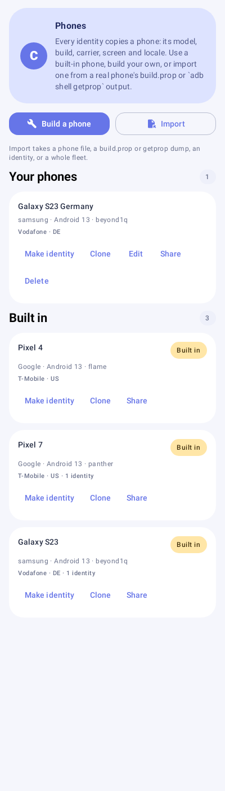

# Cyclone Cloak

**One phone, twenty profiles.**

Cyclone Cloak is the device-profile engine of the [Cyclone](https://github.com/premiumcentraal-boop/Cyclone)
agent environment. It attaches to Cyclone as a first-class phone connector (contract
`cyclone.connector/1.3`): each Cyclone profile on the phone gets its own real, fully coherent device
profile. A banking app under profile A and the same app under profile B see two completely
different phones - build fingerprint, properties, identifiers. Nothing is shared, nothing is
linked to another install.

The thin line that turns one playboy billionaire into twenty masked vigilantes.

## Status: 0.10.0-alpha.1 (pre-release; on-device validation required)

- **Companion app** (`android/app`): a Cyclone connector (contract `cyclone.connector/1.3`, Cyclone
  5.0.0-alpha.122 or newer). Imports or creates cloak profiles, binds them to the apps of Cyclone
  profiles, publishes the bound profiles for the module over su
  (`/data/adb/cyclone_cloak/state-v1/`, see docs/STATE_LAYOUT.md), and reports each binding's
  health to Cyclone so Cyclone's Rooted pill tells the truth.
- **Per-profile isolation**: bindings are keyed by Cyclone profile id and package name; the Android
  user number follows the profile (a profile restored under a new user keeps its bindings).
- **platform module** (`android/module`): for every app bound to a cloak profile, rewrites the
  `android.os.Build` statics and callbacks `SystemProperties` reads so the app sees the bound device.
  Callbacks apply once at process start; unscoped apps are untouched.
- **Root Doctor**: checks Magisk, Zygisk, module version and architecture, and profile-state publishing. Its
  explicit repair action can use the matching module bundled inside the signed app, then explains when a
  reboot and a second check are needed.
- **Profile Forge** (`forge/`): reference implementation of the coherence rules (fingerprint vs.
  model vs. patch level vs. API level), dump parsing, and stable identifier derivation
  (HMAC seeds, Luhn-valid IMEIs). Stdlib-only Python, pytest-tested.
- **Roadmap**: docs/ROADMAP.md. Remaining for Phase 1: on-device validation (issue #1), then
  identifier callbacks and the integrity layer (Phase 2).

## Using the app

Four tabs:

| Tab | What it's for |
|---|---|
| **Phones** | The phones identities are made from: three built-in (Pixel 4, Pixel 7, Galaxy S23) and your own. **Build a phone**, **Import** one, **Clone** a phone to change it, **Share** it as a file. |
| **Identities** | Make an identity from any phone (or a fleet of them), see every value it carries, rename, delete, bind it to a Cyclone profile, export or import them all. |
| **Profiles** | Your Cyclone profiles with Cloak's pill for each, **Bind all**, **Open in Cyclone**, and every bound app with its health. |
| **Health** | Root Doctor (Magisk, Zygisk, the module, publishing) and the Cyclone connection. |

### Adding a phone

- **From a real phone:** run `adb shell getprop > phone.txt` on it (or copy its `build.prop`), then
  Phones → **Import**. Cloak reads the model, build, carrier, network, density, language and time
  zone, and opens the builder for what a dump can't tell (screen size and refresh rate).
- **From scratch:** Phones → **Build a phone**. Pick the Android version (the SDK level follows), fill
  in the device and build fields; the build fingerprint is put together from them, as a real one is.
- **From a built-in phone:** **Clone** it and change what you need (for example the carrier and
  locale for another country).
- **From a file:** a phone someone shared from Cloak, or any Cloak identity (its phone can be fixed in
  the builder when it doesn't hold together).

The builder checks the same coherence rules as the desktop forge while you type (fingerprint vs.
model vs. build, release vs. SDK, patch level, carrier codes, screen, locale) and marks each problem
on its field. A phone saves only when it holds together. Identities keep their own copy of the phone
they were made from, so editing or deleting a phone never changes an identity.



## Working with Cyclone's profiles

Each Cyclone profile is its own Android user, with its own Cyclone and (since Cyclone alpha.120) its
own copy of Cloak. Cloak only talks to the Cyclone in its own Android user.

- **Approve once.** Approve Cyclone Cloak in Cyclone → Settings → Connectors (normally in Main).
  Cyclone carries the approval into each profile on a switch made on the phone. Until a profile's
  Cyclone has it, Cloak there shows one line: *Approve Cyclone Cloak in Cyclone → Settings →
  Connectors in this profile*.
- **Cloak in Main is the authority.** It binds apps in every Cyclone profile (never in Main itself)
  and writes those bindings to Main's Cyclone. Cloak inside profile C reads what Main published for C
  and writes it to C's Cyclone, so C's Profiles page shows the same pill. It may also bind C's own
  apps; for an app both bound, Main wins.
- **Health.** Cloak reports `ready`, `degraded` (for example, root not granted here, or a reboot
  pending) or `failed` (module missing or disabled, Zygisk off, identity file gone) for every bound
  app. Cyclone shows Rooted / Rooted · check / Rooted · not working / Native from it. Cloak shows its
  own pill per profile: Rooted ✓ (healthy and Cyclone's last root check passed), Rooted ! (with the
  reason), or Native.
- **Open in Cyclone.** Cloak can ask Cyclone to open another profile. Cyclone asks *you* on its own
  screen (Open / Not now); Cloak never switches anything. Cloak learns the result from Cyclone's
  `profile.switched` event.
- **Staying in step.** On start, on every Cyclone wake (`profile.switched`, `profile.updated`,
  `profile.restored`, `profile.removed`, …) Cloak re-reads the profile list, moves bindings to a
  profile's new user number, forgets permanently deleted profiles, writes what is missing or
  different, and clears what it no longer binds. Writing the same value twice is harmless.

### What Cloak sends to Cyclone

Per bound app, through `config.set.v1`, only this summary:

```json
{"cloakProfileId": "pixel-8-work", "identityVersion": 1, "name": "Work phone",
 "manufacturer": "Google", "model": "Pixel 8", "androidRelease": "15", "sdkInt": 35}
```

and through `config.status.v1` the health state (`unknown`, `ready`, `degraded`, `failed`).

### What Cloak never sends

No Android ID, IMEI, serial number, MAC address, build fingerprint, advertising or GSF id, account
name, token, password or other secret: those stay in Cloak's own profile files and the root-only
state tree. Cloak never asks Cyclone to run a command or use root, and never asks it to approve,
send, delete, grant, or create, switch or remove a profile; opening a profile is only a question
you answer on Cyclone's screen.

### Revoking

Cyclone → Settings → Connectors → Cyclone Cloak → **Revoke**, in each profile where you want it
gone. Cyclone deletes everything Cloak stored in that profile's Cyclone (the bindings above), and
its pill falls back to Native. Your cloak profiles and the module state stay on the phone until you
remove the bindings in Cloak or uninstall it.

## Development

```sh
# forge tests (Python), including the shared vectors
uv run --with pytest -- python -m pytest forge/tests

# app unit tests: forge rules, Cyclone sync, publishing, and every screen rendered (Robolectric)
gradle -p android :app:testDebugUnitTest

# android build (needs JDK 17 + Android SDK)
gradle -p android :app:assembleDebug :module:packageModule
```

CI runs all of it on every push and PR. The screen tests save a picture of each screen to
`android/app/build/screenshots` (kept as a CI artifact; copies in `docs/screenshots`).

**One set of rules, two implementations.** The built-in phones live in `catalog/phones.json`, which the
app packages as an asset and the Python forge loads. The coherence rules and the dump importer exist in
Python (`forge/cloak_forge`) and Kotlin (`android/app/.../forge`); `forge/tests/vectors` holds cases both
must answer identically. Change a rule in both, then regenerate the vectors with
`python3 forge/tools/make_vectors.py`.

## Repository layout

```
android/                  companion app (connector) + platform module
  app/src/main/java/dev/cyclone/cloak/
    forge/                phones, identities, coherence rules, dump import (pure)
    data/                 storage: identities, your phones, bindings
    root/                 Root Doctor and publishing for the module
    cyclone/              the connection to Cyclone: sync, health, events, open requests
    ui/                   the four tabs, the phone builder, CloakViewModel
  module/                 platform module: Build/props callbacks, platform zip packaging
catalog/phones.json       the built-in phones (app and forge)
docs/ARCHITECTURE.md      system design and integration contract
docs/COMPAT_SURFACE.md    every renderable surface, by phase
forge/                    profile forge: dump parsing, coherence validation, ID derivation
  tests/vectors/          cases the Python and Kotlin forge must answer the same
schema/                   profile JSON Schema (v0.1)
```

The app's layers only depend downwards (forge and data → root → cyclone → ui); `ArchitectureTest`
keeps it that way.

## License and disclaimer

MIT. Use only on devices and accounts you own - profile misuse can violate app terms of
service, and banking apps in particular decide their own risk appetite.
